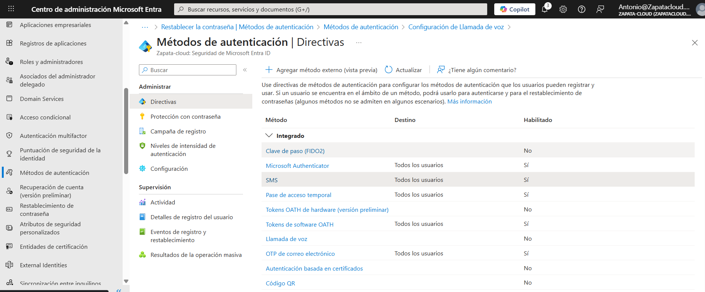
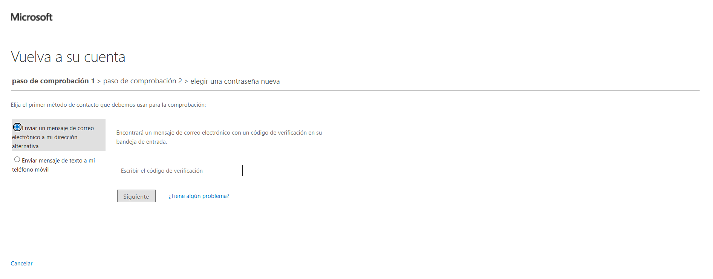
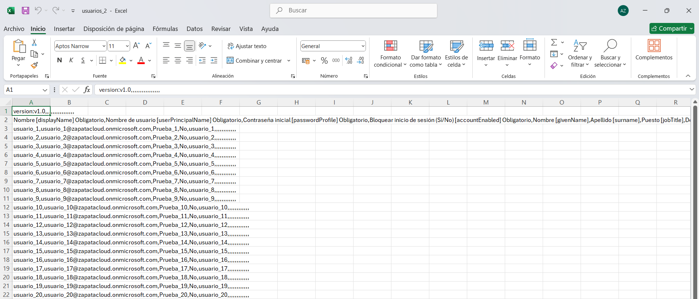
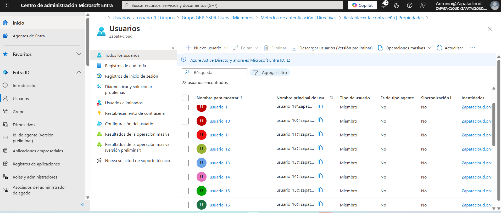

# Lab 02 — Implementación de SSPR (Self-Service Password Reset) | Microsoft Entra ID

## Contexto (por qué lo hice)
SSPR reduce tickets del Service Desk, pero si se habilita “a lo loco” puede abrir riesgos.  
En este lab lo implemento **con enfoque real**: primero un **grupo piloto**, **doble verificación** y validación del flujo completo antes de escalarlo a toda la organización.

## Objetivo
Habilitar **Self-Service Password Reset (SSPR)** de forma segura para un grupo piloto:
- Alcance controlado (**Selected**)
- **2 métodos requeridos** para el restablecimiento
- Validar el flujo real de “He olvidado mi contraseña”

---

## Alcance y configuración
- **SSPR habilitado para:** *Seleccionado* → grupo `GRP_SSPR_Users`
- **Métodos permitidos:** **Email (OTP)** + **Teléfono móvil (SMS)**
- **Número de métodos requeridos:** **2**
- **Usuario de prueba:** `usuario_1` (miembro del grupo)

---

## Tareas realizadas
1. Creación del grupo `GRP_SSPR_Users` (grupo piloto).
2. Creación del usuario `usuario_1` y asignación al grupo.
3. Activación de SSPR en modo **Selected** para el grupo piloto.
4. Habilitación de métodos para SSPR: **Email (OTP)** y **SMS**.
5. Validación del flujo real: “He olvidado mi contraseña” (el usuario ve y utiliza los métodos configurados).
6. (Extra) Creación/importación masiva de usuarios mediante **CSV**.

---

## Evidencias

### 1) SSPR habilitado para grupo piloto (Selected)

### 2) Métodos permitidos (Directivas de métodos de autenticación)
Email (OTP) + Teléfono móvil (SMS)

### 3) Validación real del flujo SSPR
Pantalla donde el usuario selecciona método (Email/SMS) durante el restablecimiento.

### 4) Extra: onboarding masivo por CSV
**CSV generado (Excel):**

**Resultado en Entra (importación):**

---

## Checklist de verificación
- [x] SSPR habilitado solo para grupo piloto
- [x] Se requieren **2 métodos** para restablecer
- [x] Métodos disponibles: **Email (OTP)** + **SMS**
- [x] Validación realizada (flujo real muestra selección de método)
- [x] Usuario de prueba incluido en el grupo
- [x] (Extra) Importación masiva por CSV documentada

---

## Qué explicaría en una entrevista / a un cliente
“Habilité SSPR para un **grupo piloto** y exigí **doble verificación** (Email + SMS) para reducir tickets sin perder seguridad.  
Antes de ampliarlo a toda la organización, validé el flujo completo de restablecimiento con un usuario de prueba. Como extra, documenté un ejemplo de **alta masiva por CSV**, algo habitual en entornos reales.”
